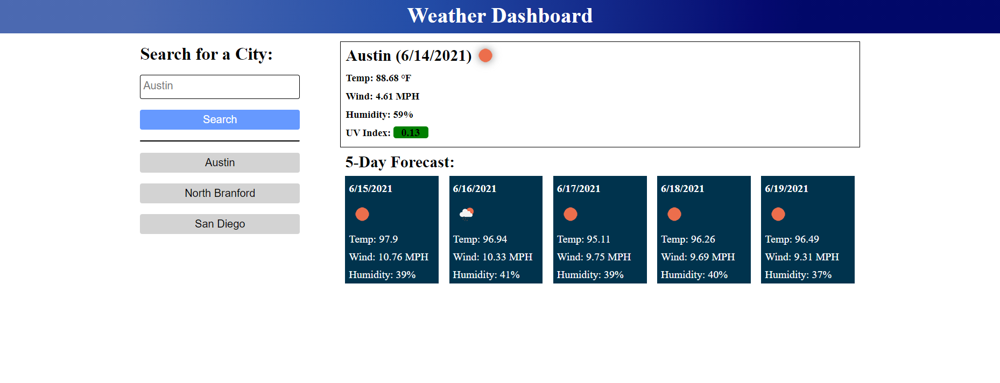

# challenge-6-weather-dashboard

## Challenge Requirements
* Create a Weather Dashboard with form inputs
* User searches for a city
* User is presented with the current weather and 5 day forecast
    * The UV index number will be highlighted green for favorable, yellow for moderate and red for severe
* Create a history of what user searched for and allow user to reload the weather data when the user clicks on button created in history for that city

## Final Website Screenshots

## Link to Portfolio Website
[Weather Dashboard Deployed Website](https://mjgiannelli.github.io/weather-rain-or-shine/)
